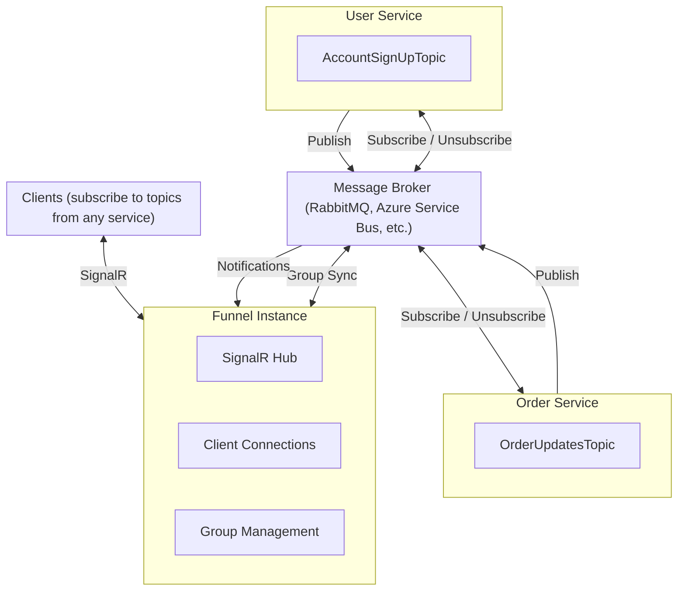
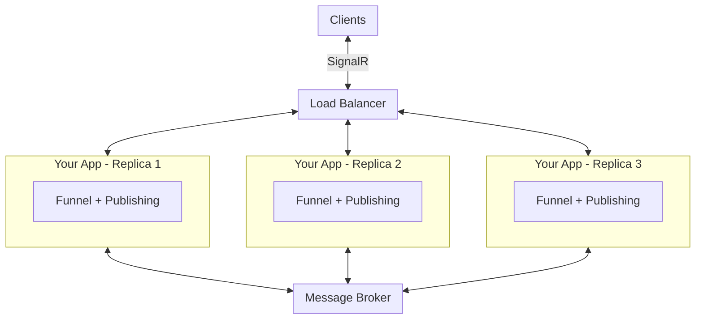
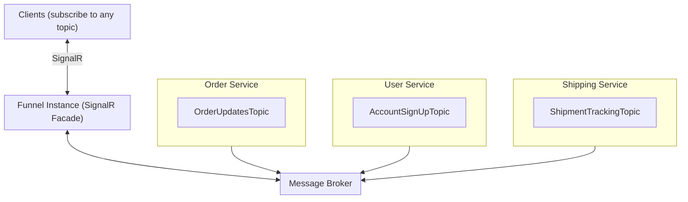
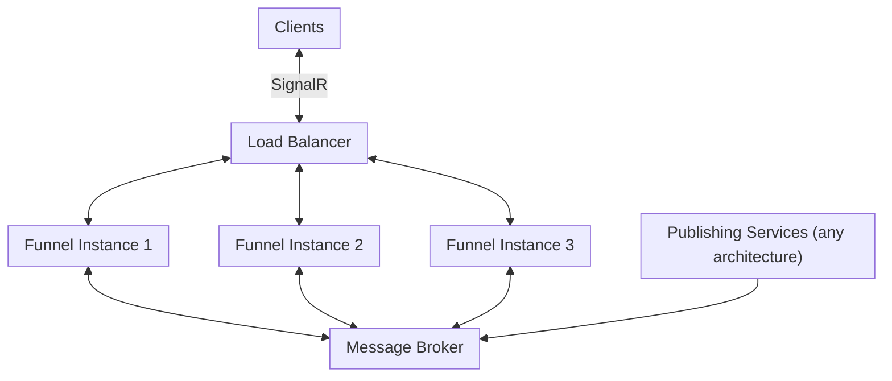

# LeanPipe Funnel

[](https://github.com/leancodepl/leanpipe/actions/workflows/funnel_msvc_tests.yml)
[](https://f.feedz.io/leancode/public/packages/LeanCode.Pipe.Funnel.Instance/latest/download)
[](https://f.feedz.io/leancode/public/packages/LeanCode.Pipe.Funnel.Publishing/latest/download)

> "We have Azure SignalR Services at home."

The Funnel is LeanPipe's solution for scaling [SignalR-based]([signalr-docs]) notifications in distributed
architectures. Similar to how Azure SignalR Service offloads connection management from
your application, the Funnel decouples SignalR connection handling from notification
publishing - but runs entirely within your infrastructure using [MassTransit as a backplane]([mt-signalr]).

## Why Standard LeanPipe Doesn't Work in Distributed Architectures

Standard LeanPipe operates by hosting SignalR directly in your application process.
When you call `ILeanPipePublisher<TTopic>.PublishAsync()`, it sends the notification
through the in-process SignalR hub to connected clients.

This creates a fundamental limitation: **the service that publishes notifications must
be the same service that holds the SignalR connections**.

This breaks down in several scenarios:

- **Horizontal scaling**: When you run multiple replicas of your service, each replica
  has its own SignalR connections. A client connected to replica A won't receive
  notifications published from replica B.
- **Microservices**: Different services define their own topics, but clients need a
  single LeanPipe endpoint to connect to. The Funnel Instance acts as a facade,
  routing subscriptions to the appropriate services.
- **Connection limits**: A single service instance can typically handle around
  10,000-65,000 concurrent SignalR connections depending on OS configuration
  (file descriptor limits, ephemeral port range). For higher connection counts,
  horizontal scaling is required.

## Benefits of Using Funnel

The Funnel architecture solves these problems by:

1. **Horizontal scaling of SignalR handlers** - Run multiple Funnel instances behind
   a load balancer to handle more concurrent connections
2. **Unified client endpoint** - Clients connect to a single LeanPipe endpoint and can
   subscribe to topics from any backend service. They receive notifications regardless
   of which service published them.
3. **Logical topic ownership** - Each service defines topics relevant to its domain
   (e.g., Order Service owns `OrderUpdatesTopic`, User Service owns `AccountSignUpTopic`)
   while clients transparently receive notifications from all of them.
4. **Scalable connection handling** - A single instance can typically handle 10,000-65,000
   concurrent connections (limited by OS file descriptors and ephemeral ports). If you
   need more, scale Funnel instances horizontally.

## Architecture Overview



**Components:**

- **Funnel Instance**: Hosts the SignalR hub, manages client connections, handles
  subscription requests by forwarding them to publishing services via MassTransit.
  Acts as a facade - clients connect here regardless of which service owns the topic.
- **Publishing Services**: Your business logic services that define topics and publish
  notifications. They use SignalR's protocol interfaces for message serialization but
  don't host SignalR connections - messages are sent through MassTransit instead.
- **Message Broker**: MassTransit-compatible broker (RabbitMQ, Azure Service Bus,
  Amazon SQS) that routes messages between components

## Deployment Scenarios

### Scenario 1: Horizontally Scaled Single Service

You have a monolithic application using LeanPipe and want to scale it horizontally.

**Solution**: Add both Funnel Instance and Publishing components to your existing
application. No additional services needed - just configure MassTransit to synchronize
SignalR groups across replicas.

The client can connect to any replica (typically via a load balancer), and notifications
will reach them regardless of which replica publishes them. This works because the
MassTransit SignalR Backplane replicates group membership and messages across all
instances.



### Scenario 2: Microservices / Multiple Publishing Services

You have a microservices architecture where each service defines topics relevant to its
domain (e.g., Order Service owns `OrderUpdatesTopic`, User Service owns `AccountSignUpTopic`),
but clients need a single LeanPipe endpoint to receive notifications from all services.

**Solution**: Deploy a dedicated Funnel Instance service that acts as a facade for all
LeanPipe connections. Clients connect to the Funnel and can subscribe to topics from
any service. Each microservice only needs the Publishing component.



### Scenario 3: Scaled Funnel Instances

You need to handle more concurrent SignalR connections than a single instance can support
(typically 10,000-65,000 connections per instance depending on configuration).

**Solution**: Deploy multiple Funnel instances behind a load balancer. All instances
share group membership and messages through the MassTransit SignalR Backplane, so
clients can connect to any instance and receive notifications published from any
publishing service.

This scenario can be combined with either Scenario 1 (monolith) or Scenario 2
(microservices) - the backend architecture doesn't change.



## Setup Guide

### Prerequisites

Install the required NuGet packages:

```bash
# For Funnel Instance (SignalR host)
dotnet add package LeanCode.Pipe.Funnel.Instance

# For Publishing Services
dotnet add package LeanCode.Pipe.Funnel.Publishing

# MassTransit with your preferred transport
dotnet add package MassTransit.RabbitMQ
# or MassTransit.Azure.ServiceBus, MassTransit.AmazonSQS, etc.
```

### Setting Up a Funnel Instance

The Funnel Instance hosts SignalR and handles client connections. It forwards
subscription requests to publishing services via MassTransit.

```csharp
using LeanCode.Pipe;
using LeanCode.Pipe.Funnel.Instance;
using MassTransit;

var builder = WebApplication.CreateBuilder(args);

// Add Funnel services (includes SignalR)
builder.Services.AddLeanPipeFunnel();

// Configure MassTransit
builder.Services.AddMassTransit(cfg =>
{
    // Add Funnel consumers for SignalR backplane
    cfg.ConfigureLeanPipeFunnelConsumers();

    cfg.UsingRabbitMq((context, rabbitCfg) =>
    {
        rabbitCfg.Host("rabbitmq://localhost");
        rabbitCfg.ConfigureEndpoints(context);
    });
});

var app = builder.Build();

// Map the LeanPipe SignalR hub
app.MapLeanPipe("/leanpipe");

app.Run();
```

### Setting Up a Publishing Service

Publishing services contain your business logic and topic definitions. They use
SignalR's protocol interfaces for message serialization, but publish notifications
through MassTransit instead of hosting SignalR connections directly.

```csharp
using LeanCode.Pipe;
using LeanCode.Pipe.Funnel.Publishing;
using MassTransit;

var builder = WebApplication.CreateBuilder(args);

// Define where your topics and handlers are located
var topicTypes = new TypesCatalog(typeof(MyTopic));
var handlerTypes = new TypesCatalog(typeof(MyTopicKeys));

// Add Funnelled LeanPipe
builder.Services.AddFunnelledLeanPipe(topicTypes, handlerTypes);

// Configure MassTransit
builder.Services.AddMassTransit(cfg =>
{
    // Add consumers for handling subscription requests from Funnel
    // "MyService" is a unique name for this service
    cfg.AddFunnelledLeanPipeConsumers("MyService", topicTypes.Assemblies);

    cfg.UsingRabbitMq((context, rabbitCfg) =>
    {
        rabbitCfg.Host("rabbitmq://localhost");
        rabbitCfg.ConfigureEndpoints(context);
    });
});

var app = builder.Build();

app.Run();
```

### Combined Setup (Horizontally Scaled Single Service)

For a monolithic application that needs horizontal scaling, combine both configurations:

```csharp
using LeanCode.Pipe;
using LeanCode.Pipe.Funnel.Instance;
using LeanCode.Pipe.Funnel.Publishing;
using MassTransit;

var builder = WebApplication.CreateBuilder(args);

var topicTypes = new TypesCatalog(typeof(MyTopic));
var handlerTypes = new TypesCatalog(typeof(MyTopicKeys));

// Add Funnel Instance services (SignalR host)
builder.Services.AddLeanPipeFunnel();

// Add Funnelled LeanPipe publishing
builder.Services.AddFunnelledLeanPipe(topicTypes, handlerTypes);

// Configure MassTransit with both consumer types
builder.Services.AddMassTransit(cfg =>
{
    // Funnel consumers for SignalR backplane synchronization
    cfg.ConfigureLeanPipeFunnelConsumers();

    // Publishing consumers for handling subscriptions
    cfg.AddFunnelledLeanPipeConsumers("MyService", topicTypes.Assemblies);

    cfg.UsingRabbitMq((context, rabbitCfg) =>
    {
        rabbitCfg.Host("rabbitmq://localhost");
        rabbitCfg.ConfigureEndpoints(context);
    });
});

var app = builder.Build();

// Map the LeanPipe SignalR hub
app.MapLeanPipe("/leanpipe");

app.Run();
```

### Publishing Notifications

Publishing API stays exactly the same as with standard LeanPipe, all changes are under the hood:

```csharp
public class OrderCompletedHandler
{
    private readonly ILeanPipePublisher<OrderTopic> publisher;

    public OrderCompletedHandler(ILeanPipePublisher<OrderTopic> publisher)
    {
        this.publisher = publisher;
    }

    public async Task Handle(OrderCompleted @event, CancellationToken ct)
    {
        var topic = new OrderTopic { OrderId = @event.OrderId };
        var notification = new OrderStatusChanged { Status = "Completed" };

        await publisher.PublishAsync(topic, notification, ct);
    }
}
```

## API Compatibility

**Important**: Both the client-side and server-side publishing APIs remain unchanged
when using the Funnel.

- Clients subscribe to topics the same way
- `ILeanPipePublisher<TTopic>` interface is identical
- Topic and notification definitions don't change
- `ISubscribingKeys<TTopic>` and `IPublishingKeys<TTopic, TNotification>` implementations
  work the same

This means you can migrate from standard LeanPipe to Funnel (or vice versa) without
changing your business logic or client code - only the startup configuration and
deployment architecture changes.

## Internal Implementation

The Funnel uses MassTransit's SignalR backplane to synchronize SignalR groups across
distributed instances and route notifications.

### Message Flow

**Subscription Flow:**

1. Client connects to Funnel Instance via SignalR and sends a subscription request
2. Funnel Instance broadcasts `CheckIfTopicIsRecognized` message to all publishing
   services (one instance of each service receives it due to competing consumers)
3. The service that owns the topic responds with `TopicRecognized`. If no service
   recognizes the topic (e.g., misconfiguration or client error), the request times
   out and returns `Malformed` status to the client.
4. Funnel Instance sends `ExecuteTopicsSubscriptionPipeline` to the publishing service
5. Publishing service runs authorization and key generation, returns
   `SubscriptionPipelineResult` with group keys
6. Funnel Instance adds the connection to the SignalR groups

Unsubscribing follows the same flow - the Funnel Instance removes the connection from
the groups instead of adding it.

**Publishing Flow:**

1. Publishing service calls `ILeanPipePublisher<TTopic>.PublishAsync()`
2. `FunnelledLeanPipePublisher` serializes the notification using SignalR's hub protocol
   and publishes `Group<LeanPipeSubscriber>` messages to MassTransit
3. MassTransit routes messages to all Funnel Instances
4. Each Funnel Instance's `GroupConsumer` receives the message and sends it to clients
   in the specified groups

## Further Reading

- [MassTransit SignalR Backplane][mt-signalr] - How MassTransit synchronizes SignalR
  across distributed instances
- [SignalR Scale-out][signalr-scaleout] - General concepts of scaling SignalR applications
- [ASP.NET Core SignalR][signalr-docs] - Official SignalR documentation

[mt-signalr]: https://masstransit.io/documentation/configuration/integrations/signalr
[signalr-scaleout]: https://learn.microsoft.com/en-us/aspnet/signalr/overview/performance/scaleout-in-signalr
[signalr-docs]: https://learn.microsoft.com/en-us/aspnet/core/signalr/introduction
